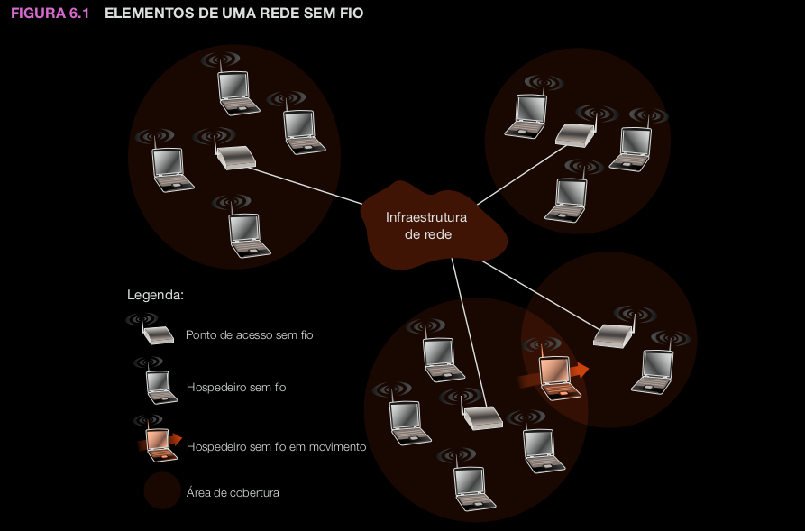

# *Introdução*
---

* *Hospedeiros sem fio*: Equipamentos de sistema finais que executam aplicações. Podem ser moveis ou não.
* *Enlaces sem fio*: É a "ponte" entre o hospedeiro sem fio e uma estação-base ou outro hospedeiro sem fio. Dependendo de sua tecnologia, podem ter taxas de transmissão diversas e distâncias variadas. Enlaces sem fio conectam hospedeiros localizados na borda da rede com a infraestrutura da rede de maior porte. Porém, eles também podem ser utilizados dentro de uma rede.
* *Estação-base*: É responsável pelo envio e recebimento de dados (por exemplo, pacotes) de um hospedeiro sem fio ligado a ela. Quando se fala que um hospedeiro está "associado" ou "ligado", isso quer dizer que o hospeideiro está dentro do alcance de comunicação se fio da estação-base e o hospedeiro usa a estação-base para retransmitir dados entre ele (o hospedeiro) e a rede maior. **Torres celulares** em redes celulares e **pontos de acesso em LANs sem fio 802.11** são exemplos. Na figura, a estação-base está conectada à rede maior (internet), portanto ela é uma retransmissora da camada de enlace entre o hospedeiro sem fio e o resto do mundo com o qual o hospedeiro se comunica. 
* *Infraestrutura de rede*: É a rede maior com a qual um hospedeiro sem fio pode querer se comunicar

* **Transferência (handoff)**: Ocorre quando o hospedeiro móvel se desloca para o alcance de outra estação-base.

Pode-se classificar as redes sem fios de 2 modos:
1. Se um pacote atravessa exatamente um salto único sem fio ou múltiplos saltos sem fio
2. Se existe infraestrutura de rede, como uma estação-base

* *Salto único, com infra*: Essa rede têm uma estação-base conectada a uma rede cabeada maior. Além disso, toda a comunicação é feita entre a estação-base e um hospedeiro sem fio. As redes 802.11 e redes de dados por celular 3G se encaixam nessa categoria.
* *Salto único, sem infra*: Nessa rede, não existe uma estação-base, porém um dos nósnessa rede de salto único pode coordenar as transmissões dos outros nós. As redes Bluetooth e as redes 802.11 em *ad hoc* são um exemplo desse tipo de rede
* *Múltiplos saltos, com infraestrutura*: Nessas redes, tem uma estação-base cabeada para as redes maiores.Entretanto, alguns nós sem fio podem ter que restabelecer sua comunicação através de outros nós sem fio para se comunicarem por meio de uma estação-base. Algumas redes de sensores sem fio e as chamadas redes em malha sem fio se encaixam nesta categoria.
* *Múltiplos saltos, sem infraestrutura*: Não existe estação-base nessas redes, e os nós podem ter de restabelecer mensagens entre diversos outros nós para chegar a um destino. Os nós também podem ser móveis, ocorrendo mudança de conectividade entre eles — uma categoria de redes conhecida como redes móveis ad hoc (MANETs). Se os nós móveis forem veículos, essa rede é denominada rede veicular ad hoc (VANET). Como você pode imaginar, o desenvolvimento de protocolos para essas redes é desafiador e constitui o assunto de muita pesquisa em andamento.

# *Características de enlaces e redes sem fio*
---

* *Redução da força do sinal*: Radiações eletromagnéticas são afetadas quando atravessam algum tipo de matéria (um sinal de rádio ao atravessar uma parede). O sinal se dispersará mesmo ao ar livre, resultando na redução de sua força à medida que aumenta a distância entre emissor e receptor.

* *Interferência de outras fontes*:  Várias fontes de rádio transmitindo na mesma frequência sofrerão interferência umas das outras. Por exemplo, telefones sem fio de 2,4 GHz e LANs sem fio 802.11b transmitem na mesma banda de frequência. Assim, o usuário de uma LAN sem fio 802.11b que estiver se comunicando por um telefone sem fio de 2,4 GHz pode esperar que ambas não funcionem bem. Além disso, o ruído eletromagnético presente no ambiente (um motor ou um equipamento de micro-ondas próximo) pode causar interferência.

* *Propagação multivias*: A propagação multivias ocorre quando partes da onda eletromagnética se refletem em objetos e no solo e tomam caminhos de comprimentos diferentes entre um
emissor e um receptor. Isso resulta no embaralhamento do sinal recebido no destinatário. Objetos que se movimentam entre o emissor e o receptor podem fazer com que a propagação multivias mude ao longo do tempo.

## *CDMA*

# *Wi-Fi: LANs sem fio 802.11*
---

## *A arquitetura 802.11*

## *O protocolo MAC 802.11*

## *O quadro IEEE 802.11*

## *Mobilidade na mesma sub-rede IP*

## *Recursos avançados em 802.11*

## *Redes pessoais: Bluetooth e Zigbee*

# *Acesso celular à internet*
---

## *Visão geral da arquitetura de rede celular*

## *Redes de dados celulares 3G*

## *No caminho pro 4G: LTE*

# *Gerenciamento da mobilidade: princípios*
---

## *Endereçamento*

## *Roteamento para um nó móvel*

# *IP Móvel*
---

# *Gerenciamento de mobilidade em redes celulares*
---

## *Roteando chamadas para um usuário móvel*

## *Transferências (handoffs) em GSM*

# *Redes sem fio e mobilidade*
---

# *Resumo*
---
